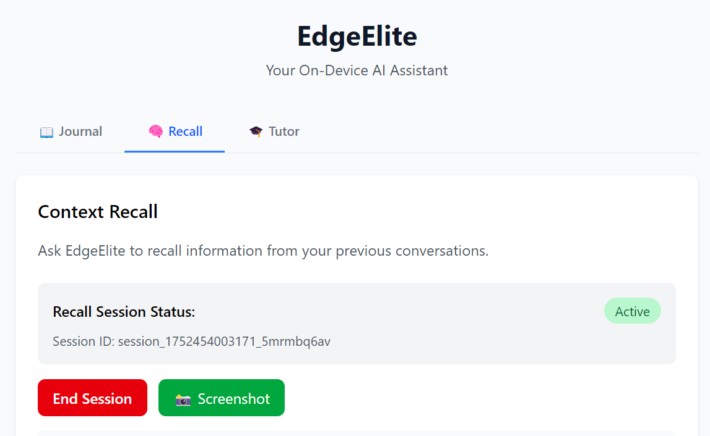

<p align="center">
  
</p>

# EdgeElite

EdgeElite addresses the real-world gap in context-aware productivity tools by acting as a real-time, on-device assistant that sees what you see (via OCR), hears what you hear (via ASR), and intelligently surfaces just-in-time suggestions—enabling fast, private, and personalized support without cloud reliance.

---

## 👩‍💻 Developers

- **Mansi Garg**  
  Email: mansigar@usc.edu
- **Aryan Vij**  
  Email: aryanv0213@berkeley.edu
- **Natalie Tang**  
  Email: nattang@mit.edu
- **Ruthwika Gajjala**  
  Email: ruthwika11@gmail.com
- **Brayden Mazepa**  
  Email: braymazepa@gmail.com


---

## ⚙️ Setup Instructions

### 🔧 1. Install Dependencies

#### 📦 Backend (Python 3.8+)

```bash
cd backend
python -m venv .venv
source .venv/bin/activate     # On Windows: .venv\Scripts\activate
pip install -r requirements.txt
```

#### 💻 Frontend (Electron + React)

From the **project root**:

```bash
npm install      # or: yarn / pnpm install
```

---
### 🧠 2. Downloading Models
- **Place the below models in**: `backend/models/`
#### ➤ OCR Model
- **Download**: [EasyOCR](https://aihub.qualcomm.com/compute/models/easyocr?domain=Multimodal&useCase=Image+To+Text)  
Note: Please make sure to download both the detector and recognizer models

#### ➤ ASR Model
- **Download**: [Whisper-Large-V3-Turbo](https://aihub.qualcomm.com/compute/models/whisper_large_v3_turbo?domain=Audio&useCase=Speech+Recognition)  
Note: Please make sure to download both the Decoder and Encoder
---

## 🚀 Run the Application

### ▶️ Start the Backend

```bash
cd backend
uvicorn main:app --reload --host 0.0.0.0 --port 8000
```

This starts the FastAPI server at `http://localhost:8000`.

### ▶️ Start the Frontend

From the project root:

```bash
npm run start
```

This opens the Electron app with the React UI.

---

### 🧠 How to Use EdgeElite

1. **Open the app**  
   Launch EdgeElite to begin.

2. **Start a session**  
   EdgeElite will automatically begin listening through your device’s microphones.

3. **Speech recognition**  
   Your locally downloaded ASR (Automatic Speech Recognition) models will transcribe your speech in real-time and store the results in a searchable local database.

4. **Capture your screen**  
   Click the **Screenshot** button whenever you want to capture visual content from your screen.

5. **Optical Character Recognition (OCR)**  
   Your locally downloaded OCR models will extract text from the screenshot and store it alongside your audio data.

6. **Recall past moments**  
   Ask EdgeElite questions about things you've said or seen. It uses its database to retrieve relevant moments from your session history.

7. **View & manage results**  
   All recognized content is displayed in the UI. You can **save**, **edit**, or **export** results to other tools.


## 🗂 Project Structure

```
edgeelite/
├── backend/                    # FastAPI backend with AI services
│   ├── main.py                 # API entrypoint and routes
│   ├── asr.py                  # Audio/Speech Recognition
│   ├── llm.py                  # Large Language Model service
│   ├── ocr/                    # Optical Character Recognition
│   ├── storage/                # Data storage and retrieval
│   └── models/                 # AI model files (OCR, ASR, LLM)
├── renderer/                   # Next.js frontend application
├── main/                       # Electron main process
├── captures/                   # Screenshot storage
├── recordings/                 # Audio recording storage
├── docs/                       # Documentation
└── resources/                  # Application resources
```


## 📦 Requirements Summary

| Component       | Toolchain              |
|----------------|------------------------|
| Backend         | Python 3.8+, FastAPI, Uvicorn, ONNX Runtime |
| Frontend        | Node.js 18+, Electron, React |
| OCR Inference   | EasyOCR, Pillow, OpenCV |


