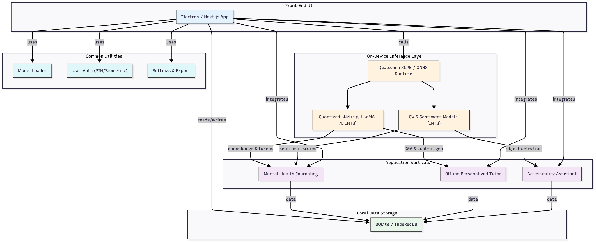
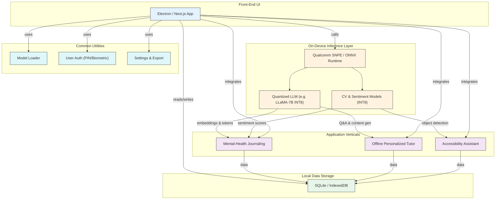

## Architecture Diagram



# EdgeElite On-Device AI Architecture Documentation

## 1. Text Extraction

### What specific information should be extracted per frame?
- **All Visible Text**: Every block of OCR’d text on screen—menus, dialogs, captions.  
- **Window Title / App Name**: Top-bar or title-bar text to capture overall context (e.g., “Slack — #team-chat”).  
- **URLs & Navigational Cues**: Any text matching `http(s)://…` or `www.…` to indicate browser context.  
- **Timestamps or Counters**: Media player times or other session indicators (e.g., “00:45 / 03:00”).  

### How do we clean and format the OCR output to make it usable for embeddings and LLMs?
1. **Whitespace & Line-Break Normalization**: Collapse multiple spaces into one; convert errant line-breaks into spaces.  
2. **Punctuation & Noise Filtering**: Remove spurious characters (e.g., `|`, `–`) and OCR artifacts like repeated symbols.  
3. **Spell-Correction / Dictionary Check**: Quick pass with a lightweight on-device spellchecker (e.g., SymSpell).  
4. **Segment & Tag Blocks**: Wrap each logical block with labels, for example:
   ```
   [WINDOW_TITLE] Slack — #team-chat
   [TEXT_BLOCK] Hey team, the deploy...
   [URL] https://example.com
   ```
5. **Token-Count Trimming**: If output exceeds token limits (e.g., 512 tokens), keep the most substantial blocks or slide a window.  

### Do we extract any layout or positional metadata (e.g., bounding boxes) for context relevance?
- **Why It Helps**: Spatial cues can hint at UI elements (notifications vs. main content) and improve relevance scoring.  
- **What to Record**:
  ```json
  {
    "text": "Submit",
    "bbox": [x1, y1, x2, y2],
    "block_id": 7,
    "frame_ts": 1690045600.123
  }
  ```
  - `bbox`: normalized screen coordinates (0–1)  
  - `block_id`: sequence number within the frame  
  - `frame_ts`: capture timestamp  
- **How to Use**:  
  - Filter out small UI bits (font size threshold).  
  - Guide LLM prompt engineering by tagging text location (“top-bar text:” vs. “pop-up text:”).  
  - Weight larger blocks higher in similarity searches.  

## 2. Audio (Speech) Pipeline

### a) Data Alignment

#### How do we timestamp and align ASR output with OCR screenshots?
- **Single Clock Source**: Use one monotonic clock (e.g., `time.monotonic()`) for both frames and audio segments.  
- **Attach Timestamps**:
  - **Screenshots**: Record `frame_ts = now()` at capture.  
  - **Audio Chunks**: Record `audio_start_ts` and `audio_end_ts` for each VAD or fixed-window segment.  
- **Frame Matching Strategies**:
  - **Nearest-Neighbor**: Associate each ASR chunk with the screenshot whose timestamp is closest to the audio midpoint.  
  - **Window Join**: Group screenshots whose `frame_ts` falls between the ASR segment’s start and end times.  
- **Indexed Event Stream**: Store a unified stream of events, for example:
  ```json
  { "type": "ocr", "ts": 1690045600.123, "text_blocks": [...] },
  { "type": "asr", "start_ts": 1690045600.100, "end_ts": 1690045600.400, "transcript": "Hello team..." }
  ```
  Later, pull the last N events in order for LLM context.

#### Do we need to store who is speaking (e.g., speaker diarization)?
- **MVP (v1)**: Skip diarization—assume a single user speaker to simplify integration.  
- **Future Enhancement**: Integrate a lightweight on-device diarization model from Qualcomm AI Hub, tag ASR events with `speaker_id`, and use for multi-participant scenarios.

---

*Generated on July 11, 2025 by EdgeElite Hackathon Planning Assistant.*
